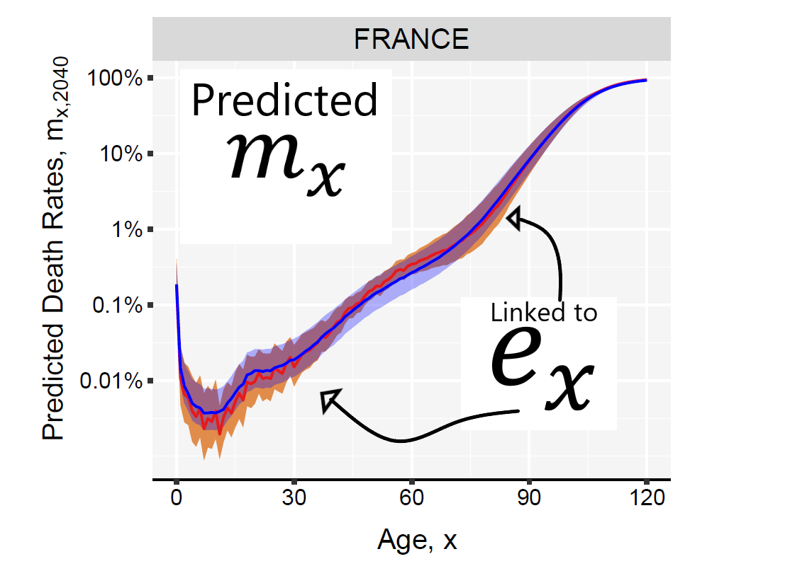

# The Linear Link: Deriving Age-Specific Death Rates from Life Expectancy

This folder includes R and \Latex source code written for the study presented in [Pascariu et al. (2020)](https://doi.org/10.3390/risks8040109) with the aim of introducing the Linear-Link model.
The manuscript is published as an original peer-review article in the Special Issue [Mortality Forecasting and Applications](https://www.mdpi.com/journal/risks/special_issues/Mortality_Forecasting_Applications) of the MDPI journal Risks.

### Authors

Marius D. Pascariu, Ugofilippo Basellini, José Manuel Aburto and Vladimir Canudas-Romo

### Abstract
The prediction of human longevity levels in the future by direct forecasting of life expectancy offers numerous advantages, compared to methods based on extrapolation of age-specific death rates. However, the reconstruction of accurate life tables starting from a given level of life expectancy at birth, or any other age, is not straightforward. Model life tables have been extensively used for estimating age patterns of mortality in poor-data countries. We propose a new model inspired by indirect estimation techniques applied in demography, which can be used to estimate full life tables at any point in time, based on a given value of life expectancy at birth. Our model relies on the existing high correlations between levels of life expectancy and death rates across ages. The methods presented in this paper are implemented in a publicly available R package.

### Share and Cite
Pascariu, M.D.; Basellini, U.; Aburto, J.M.; Canudas-Romo, V. The Linear Link: Deriving Age-Specific Death Rates from Life Expectancy. Risks 2020, 8, 109. DOI: 10.3390/risks8040109

